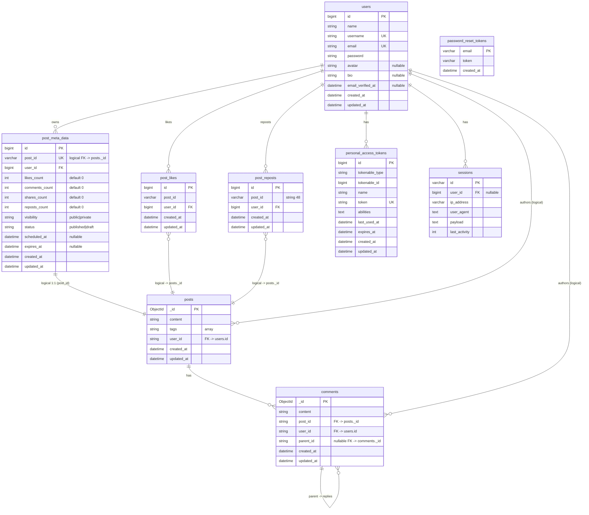
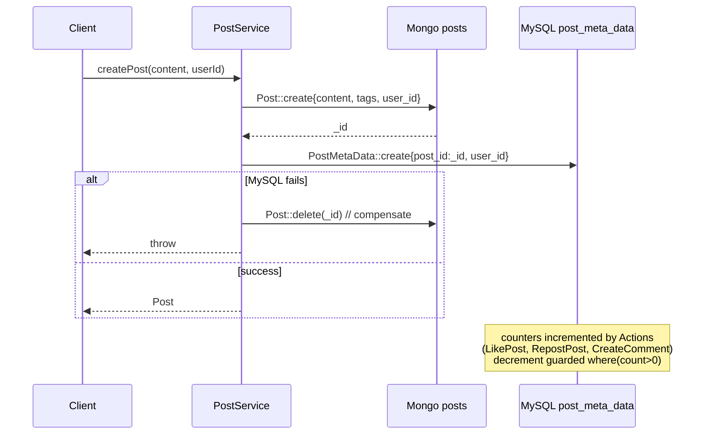

# Database Schema

> ThreadsApp — Hybrid MySQL (relational) + MongoDB (document). ERD in Mermaid; see `docs/ARCHITECTURE.md` and `docs/SSD.md` for context.

## 1. Overview

* **MySQL 8** — users, counters, relations, framework tables. Source: `database/migrations/*.php`.
* **MongoDB 6** (`mongodb/laravel-mongodb`) — `posts`, `comments`, `tags` collections. Flexible schema, `$graphLookup` for threads.
* **Logical FK** — `post_meta_data.post_id`, `post_likes.post_id`, `post_reposts.post_id` store Mongo `posts._id` as `VARCHAR(36)/CHAR(48)` (stringified `ObjectId`), not DB-enforced.

## 2. Entity-Relationship Diagram (MySQL + Mongo logical links)



> Render with any Mermaid renderer (GitHub, GitLab, `mermaid-cli`). Dashed/logical links cross the MySQL↔Mongo boundary (app-enforced).

## 3. MySQL Tables (DDL summary)

### 3.1 `users` — `0001_01_01_000000_create_users_table.php`

```sql
CREATE TABLE users (
  id BIGINT UNSIGNED AUTO_INCREMENT PRIMARY KEY,
  name VARCHAR(255) NOT NULL,
  username VARCHAR(255) NOT NULL UNIQUE,
  email VARCHAR(255) NOT NULL UNIQUE,
  avatar VARCHAR(255) NULL,
  bio VARCHAR(255) NULL,
  email_verified_at TIMESTAMP NULL,
  password VARCHAR(255) NOT NULL,
  remember_token VARCHAR(100) NULL,
  created_at TIMESTAMP NULL,
  updated_at TIMESTAMP NULL
);
CREATE TABLE password_reset_tokens (email VARCHAR(255) PRIMARY KEY, token VARCHAR(255), created_at TIMESTAMP NULL);
CREATE TABLE sessions (id VARCHAR(255) PRIMARY KEY, user_id BIGINT NULL INDEX, ip_address VARCHAR(45) NULL, user_agent TEXT NULL, payload LONGTEXT, last_activity INT INDEX);
```

### 3.2 `cache` / `jobs` — framework

`cache(key PK, value MEDIUMTEXT, expiration INT)`, `cache_locks`, `jobs`, `job_batches`, `failed_jobs` — default Laravel.

### 3.3 `personal_access_tokens` — Sanctum

`id, tokenable (morph), name, token VARCHAR(64) UNIQUE, abilities TEXT, last_used_at, expires_at, timestamps`.

### 3.4 `post_meta_data`

```sql
CREATE TABLE post_meta_data (
  id BIGINT UNSIGNED AUTO_INCREMENT PRIMARY KEY,
  post_id CHAR(36) NOT NULL COMMENT 'UUID string of posts._id',
  user_id BIGINT UNSIGNED NOT NULL,
  likes_count INT DEFAULT 0,
  comments_count INT DEFAULT 0,
  shares_count INT DEFAULT 0,
  visibility VARCHAR(255) DEFAULT 'public',
  status VARCHAR(255) DEFAULT 'published',
  scheduled_at TIMESTAMP NULL,
  expires_at TIMESTAMP NULL,
  created_at TIMESTAMP NULL,
  updated_at TIMESTAMP NULL,
  FOREIGN KEY (user_id) REFERENCES users(id)
);
-- 2026_05_16 adds:
ALTER TABLE post_meta_data ADD reposts_count INT DEFAULT 0 AFTER shares_count;
```

### 3.5 `post_likes` / `post_reposts`

```sql
CREATE TABLE post_likes (
  id BIGINT UNSIGNED AUTO_INCREMENT PRIMARY KEY,
  post_id CHAR(36) NOT NULL, -- UUID of posts._id
  user_id BIGINT UNSIGNED NOT NULL,
  created_at TIMESTAMP NULL, updated_at TIMESTAMP NULL,
  UNIQUE (post_id, user_id), INDEX (post_id), INDEX (user_id)
);
CREATE TABLE post_reposts (
  id BIGINT UNSIGNED AUTO_INCREMENT PRIMARY KEY,
  post_id VARCHAR(48) NOT NULL,
  user_id BIGINT UNSIGNED NOT NULL,
  created_at TIMESTAMP NULL, updated_at TIMESTAMP NULL,
  UNIQUE (post_id, user_id), INDEX (post_id), INDEX (user_id)
);
```

## 4. MongoDB Collections

### 4.1 `posts` — `App\Models\Post` (`connection: mongodb, collection: posts`)

```js
{
  _id: ObjectId("..."),
  content: "hello #world",
  tags: ["world"],          // via HashtagTrait::filterHashTags on write
  user_id: NumberLong(1),   // users.id (int)
  created_at: ISODate("2026-08-25T00:00:00Z"),
  updated_at: ISODate("...")
}
// fillable: content, tags, user_id
// indexes: CreateSearchIndexes command creates {user_id:1}, {tags:1}, {created_at:-1}
```

### 4.2 `comments` — `App\Models\Comment`

```js
{
  _id: ObjectId("..."),
  content: "nice!",
  post_id: "66a1…",         // stringified posts._id
  user_id: NumberLong(1),
  parent_id: ObjectId("...") | null, // self-ref for replies
  created_at: ISODate("..."),
  updated_at: ISODate("...")
}
// indexes: {post_id:1}, {parent_id:1}, {post_id:1, parent_id:1}
```

### 4.3 `tags` — via `TagFactory` (hashtag dictionary)

Minimal `{_id, name}`; posts embed tag strings directly (denormalized) — no join.

## 5. Indexes & Performance

```mermaid
flowchart LR
    subgraph MySQL
        U[users.username/email UNIQUE]
        L[post_likes (post_id,user_id) UNIQUE]
        R[post_reposts (post_id,user_id) UNIQUE]
        M[post_meta_data post_id + user_id FK]
    end
    subgraph Mongo
        P1[posts.user_id]
        P2[posts.tags]
        P3[posts.created_at desc]
        C1[comments.post_id]
        C2[comments.parent_id]
    end
    Q1[Feed: latest().paginate] --> P3
    Q2[Search tags regex] --> P2
    Q3[Thread graphLookup] --> C1 & C2
    Q4[Transformer batch whereIn] --> U & M
```

* `PostService::getFeed` hits `posts.created_at` index; `PostService::getRepostedPosts` avoids N+1 via `whereIn` + `keyBy`.
* `CommentService::getThread` uses single `$graphLookup` (maxDepth 50) vs iterative frontier loop fallback.
* `PostTransformer` caches user batches `Cache::remember('users:{hash}', 300s)`.

## 6. Consistency & Counters



No XA across DBs; rebuild `post_meta_data` from Mongo counts if drift detected.

## 7. Migrations & Seeders

Run:

```bash
php artisan migrate
php artisan db:seed           # UserSeeder, PostSeeder, PostMetaDataSeeder
php artisan search:indexes    # CreateSearchIndexes — Mongo indexes
```

Factories: `UserFactory`, `PostFactory`, `PostMetaDataFactory`, `TagFactory` — Faker-based, usable in `RefreshDatabase` tests.

## 8. References

* `database/migrations/*.php` — source of truth
* `app/Models/*.php` — fillable/casts/relations
* `app/Transformers/PostTransformer.php` — batch hydration
* `docs/ARCHITECTURE.md` — hybrid rationale
* `docs/SSD.md` — requirements & decisions

