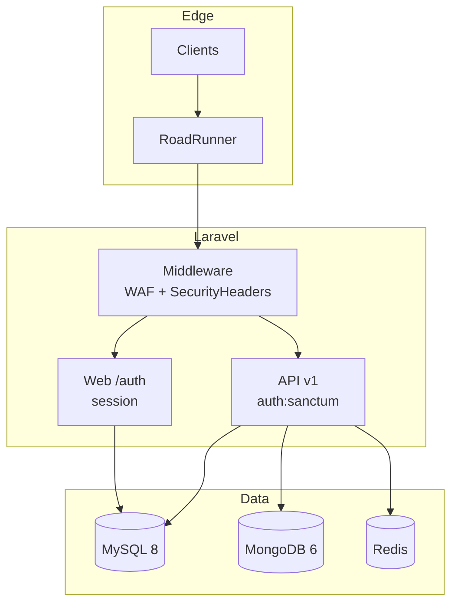
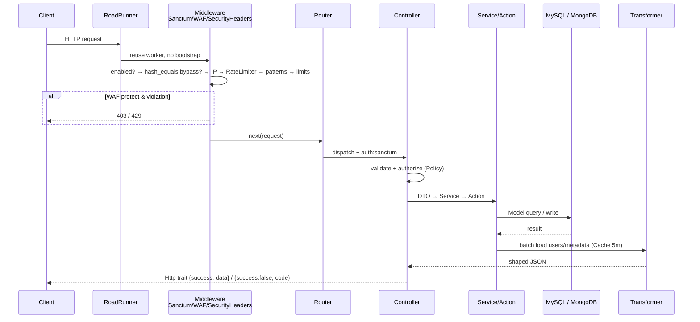
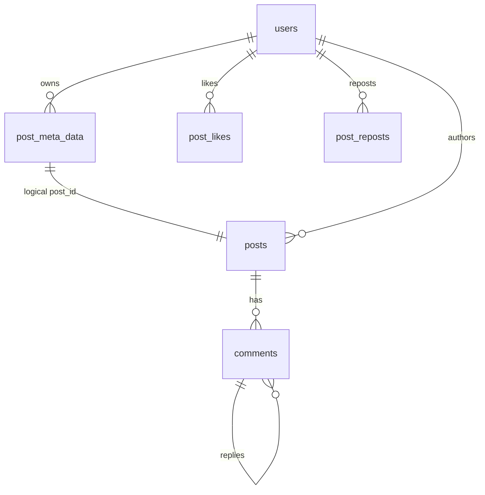
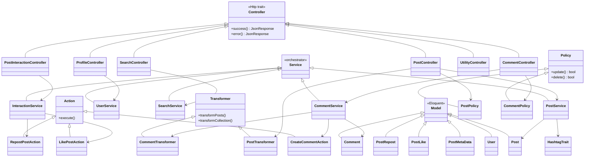
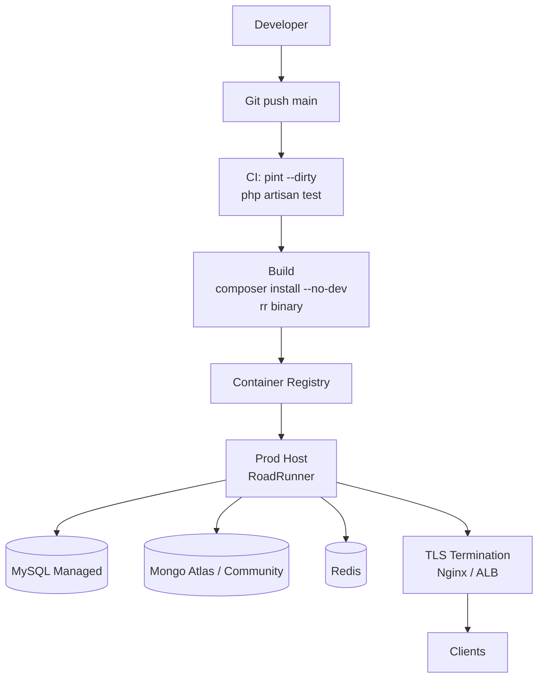

# Architecture

> ThreadsApp API — Laravel 12 + Hybrid MySQL/MongoDB + RoadRunner

## 1. Overview

ThreadsApp is a Threads-like social API. The design optimises for:

* **Write-heavy feeds** — posts/comments stored in MongoDB for horizontal scale and schema flexibility.
* **Relational integrity** — users, likes, reposts, counters stored in MySQL where transactions/joins matter.
* **Low latency** — RoadRunner (persistent PHP workers) + Redis + response caching.
* **Security-first** — WAF + security headers run before any controller logic.

```mermaid
flowchart LR
    Client[Client<br/>web / mobile] --> RR[RoadRunner<br/>persistent workers]
    RR --> LARAVEL[Laravel 12<br/>bootstrap/app.php]
    LARAVEL --> MW[api middleware<br/>Sanctum Stateful<br/>WAF<br/>SecurityHeaders]
    MW --> ROUTER[Router<br/>api.php / web.php→auth.php]
    ROUTER --> CTRL[Controllers<br/>Post / Comment / Profile / Search<br/>Auth]
    CTRL --> SVC[Services<br/>PostService / CommentService<br/>UserService / SearchService<br/>InteractionService]
    SVC --> ACT[Actions / DTOs<br/>CreateComment / LikePost / RepostPost]
    ACT --> MODEL[Models<br/>User MySQL<br/>Post/Comment Mongo<br/>PostMetaData/Like/Repost MySQL]
    MODEL --> DBM[(MongoDB<br/>posts, comments)]
    MODEL --> DBS[(MySQL<br/>users, counters)]
    SVC --> TRANS[Transformers<br/>PostTransformer / CommentTransformer<br/>Cache 5m]
    TRANS --> JSON[JSON<br/>Http trait {success,data}]
    JSON --> Client
```



## 2. Technology Stack

| Layer | Choice | Reason |
|-------|--------|--------|
| Framework | Laravel 12, PHP 8.3 | Mature ecosystem, Sanctum, Policies |
| App server | RoadRunner (`spiral/roadrunner-http`) + Octane | Persistent workers, ~3× throughput vs php-fpm |
| Auth | Laravel Sanctum (SPA stateful + Bearer tokens) | Simple token auth for `/api/v1/*`, session for `/auth/*` |
| Primary DB | MySQL 8 (users, `post_meta_data`, `post_likes`, `post_reposts`, tokens, jobs, cache) | FKs, counters, joins |
| Document DB | MongoDB 6 via `mongodb/laravel-mongodb` (`posts`, `comments`, `tags`) | Scale for feed, flexible tags, `$graphLookup` for threads |
| Cache/Queue | Redis 7 (optional, `CACHE_STORE=array` in tests) | Rate-limit, user batch cache |
| Tooling | Pint, PHPUnit 11, Clockwork, Breeze (auth scaffolding) |  |

## 3. Project Structure

```
app/
  Actions/        # Single-purpose write operations (CreateComment, LikePost, RepostPost)
  Console/Commands # WafManageCommand, CreateSearchIndexes
  DTOs/           # PostData, CommentData, InteractionResult — typed input between layers
  Http/
    Controllers/Api    # Post, Comment, Profile, Search, PostInteraction, Utility
    Controllers/Auth   # Breeze session auth (register/login/logout/verify)
    Middleware/        # WebApplicationFirewall, SecurityHeaders, EnsureEmailIsVerified
    Requests/          # FormRequest validation (PostRequest, RegisteredUserRequest…)
    Resources/         # PostResource (kept, primary transform is Transformers/)
  Models/         # User (MySQL), Post/Comment (Mongo), PostMetaData/Like/Repost/Tag (MySQL)
  Policies/       # PostPolicy, CommentPolicy — authorize update/delete
  Providers/      # WafServiceProvider, AppServiceProvider
  Services/       # PostService, CommentService, InteractionService, SearchService, UserService
  Transformers/   # PostTransformer, CommentTransformer — batch hydration + caching
  Utils/          # Http trait (success/error helpers), HashtagTrait, RegisteredUser
bootstrap/app.php # Route + middleware registration (api prepend stack)
config/waf.php    # Single source of WAF rules (see docs/WAF_*.md)
routes/
  api.php         # /api/v1/* (auth:sanctum) + public /api/ping-mongodb, /api/v1/waf-test
  web.php → auth.php # /auth/* session routes (register/login/verify)
  console.php
database/
  migrations/     # users, cache, jobs, personal_access_tokens, post_meta_data, likes, reposts
  factories/      # User, Post, PostMetaData, Tag
  seeders/        # UserSeeder, PostSeeder, PostMetaDataSeeder
tests/Feature/    # Auth, Post, PostInteraction, Search, Waf, MongoDB, UserProfile
docs/             # This file + API_CONTRACT, SSD, WAF_README, WAF_IMPLEMENTATION
```

## 4. Request Lifecycle



1. **RoadRunner** receives HTTP, reuses worker (no bootstrap per request).
2. `bootstrap/app.php` `withMiddleware` prepends `EnsureFrontendRequestsAreStateful` → `WebApplicationFirewall` → `SecurityHeaders` to `api` group.
3. **WAF** (`app/Http/Middleware/WebApplicationFirewall.php`):
   `enabled? → bypass token (hash_equals) → IP check → rate limit (RateLimiter) → pattern scans (SQLi/XSS/traversal/UA) → size limits → file upload` — `monitor` logs only, `protect` returns 403/429.
4. **SecurityHeaders** adds HSTS, X-Frame-Options, CSP (prod), Cache-Control for `api/*`.
5. Router dispatches to controller; `auth:sanctum` verified for `/api/v1/*`.
6. Controller validates (`FormRequest`/`$request->validate`), authorizes (`$this->authorize`/`cannot`), delegates to **Service**.
7. Service applies business rules, calls **Action** for writes, uses **DTO** for typed params.
8. **Model** hits MySQL or MongoDB. Cross-DB consistency is manual: `PostService::createPost` rolls back Mongo doc if MySQL `PostMetaData` fails; `deletePost` best-effort metadata cleanup.
9. **Transformer** batch-loads users/metadata/likes/reposts (with `Cache::remember` for users, 5 min) and shapes JSON.
10. `Http` trait wraps in `{success, message?, data}` or `{success:false, message, code}`.

## 5. Data Architecture



> Full ERD with columns, indexes and MySQL ↔ Mongo links: see `database/SCHEMA.md` and `docs/database/SCHEMA.md`.

### 5.1 MySQL (relational)

```
users(id, name, username UNIQUE, email UNIQUE, password hashed, avatar, bio, email_verified_at)
post_meta_data(id, post_id VARCHAR FK→posts._id logical, user_id FK, likes_count, comments_count, shares_count, reposts_count)
post_likes(id, post_id VARCHAR, user_id, timestamps, UNIQUE(post_id,user_id))
post_reposts(id, post_id VARCHAR, user_id, timestamps, UNIQUE(post_id,user_id))
personal_access_tokens, cache, jobs, sessions, password_reset_tokens (framework)
```

Counters are denormalized for feed speed; incremented via `CreateCommentAction` / `LikePostAction` / `RepostPostAction` with guarded `where(col,>,0)->decrement`.

### 5.2 MongoDB

```
posts { _id:ObjectId, content:String, tags:String[], user_id:Number|String, created_at, updated_at }
comments { _id, content, post_id:String, user_id, parent_id:String|null, created_at }
tags { _id, name } // via TagFactory, hashtag extraction
```

`PostService::getFeed` uses `latest()` (= `created_at desc`). `CommentService::getThread` uses `$graphLookup` on `comments` to flatten descendants in one aggregation (maxDepth 50, sorted `created_at asc`).

### 5.3 Hybrid Consistency

No XA transaction across MySQL+Mongo. Strategy: **Mongo first, MySQL second, compensate on failure**. Acceptable for social content (eventual counter drift is tolerable; `PostMetaData` can be rebuilt from Mongo counts if needed).

## 6. Layering & Patterns



* **Controllers are thin**: validate, authorize, delegate to Service, return `Http::success/error`. Fat logic (e.g. old `CommentController` 454 LoC) was extracted.
* **Services are orchestrators**: `PostService`, `CommentService`, `InteractionService`, `SearchService`, `UserService`. They own queries, transactions, logging.
* **Actions are atomic writes**: single `execute()` method, called by Services.
* **DTOs** (`PostData`, `CommentData`) carry validated input.
* **Transformers** handle N+1 avoidance (single `whereIn` per relation) and presentation (`diffForHumans`, `reply_count`, `replying_to`).
* **Policies** gate `update`/`delete` on ownership.
* **Traits** (`HashtagTrait`, `Http`, `RegisteredUser`) share cross-cutting helpers.

## 7. Security

See `docs/WAF_README.md` and `docs/WAF_IMPLEMENTATION.md` for WAF detail. Summary:

* `WebApplicationFirewall` (regex patterns for SQLi/XSS/traversal, UA block, file extension/size, URI/post size, `hash_equals` bypass tokens).
* `SecurityHeaders` (HSTS, X-Frame-Options, X-Content-Type-Options, Referrer-Policy, Permissions-Policy, CSP prod, Cache-Control).
* Auth: Sanctum tokens, `password: hashed` cast, email verification (`signed` route + `EnsureEmailIsVerified`), throttle `6,1` on verify, rate limits on `api/*` / `api/auth/*` / `api/register`.
* `UtilityController` endpoints are intentionally unauthenticated but sanitized (no request reflection, no exception leak, `config()` not `env()`).

## 8. Caching & Performance

* `PostTransformer` caches user batches (`users:{hash}` 300s, `Cache::remember`).
* `WAF` rate limits via `RateLimiter` (Redis or array in tests).
* RoadRunner persistent workers + `opcache` (prod).
* `CreateSearchIndexes` command creates Mongo indexes for search.
* Pagination capped (`per_page` min 15 max 50, default 15).

## 9. Testing

PHPUnit 11, `RefreshDatabase`, `Sanctum::actingAs`. Suites: `Auth/*`, `PostTest`, `PostInteractionTest`, `UserProfileTest`, `SearchTest`, `MongoDBTest`, `WafTest`/`WafEdgeCasesTest`. Run: `php artisan test --filter=WafTest`.

## 10. Deployment



* Dev: `composer install && cp .env.example .env && php artisan key:generate && php artisan migrate --seed && ./rr serve` or `php artisan serve`.
* Prod: `APP_ENV=production APP_DEBUG=false`, managed MySQL/MongoDB/Redis, `WAF_ENABLED=true WAF_MODE=protect`, `./rr serve -c .rr.prod.yaml`, OpCache, TLS termination before RoadRunner.

## 11. Decisions & Trade-offs

* **Hybrid DB vs single DB**: gained feed scale, paid cross-DB compensation complexity.
* **RoadRunner vs Octane+Swoole**: RR binary is simpler to ship, no Swoole extension; similar performance.
* **Regex WAF vs ModSecurity**: simpler, no extra proxy, but regex is brittle vs full WAF engine — mitigated by `monitor` mode + allowlist.
* **Transformers vs API Resources**: Transformers batch more aggressively; `PostResource` remains for potential JSON:API use.

