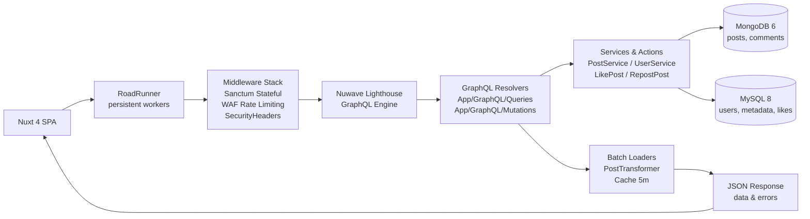
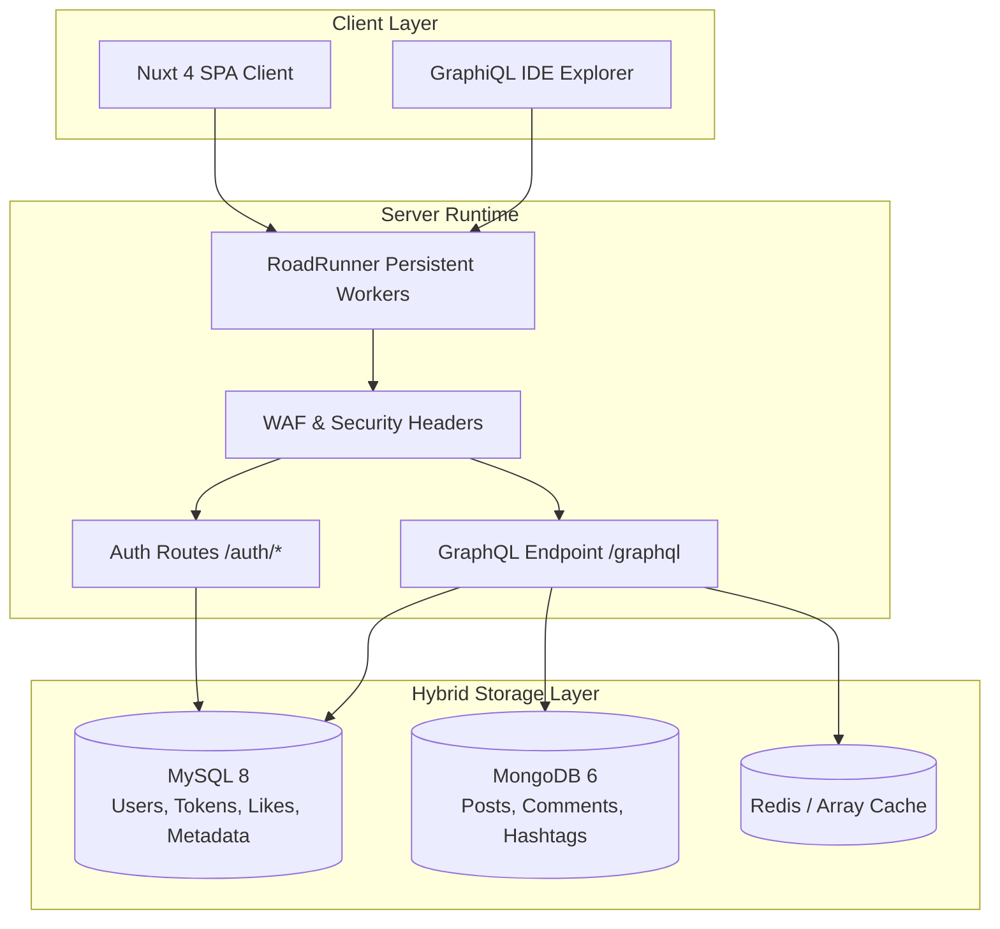
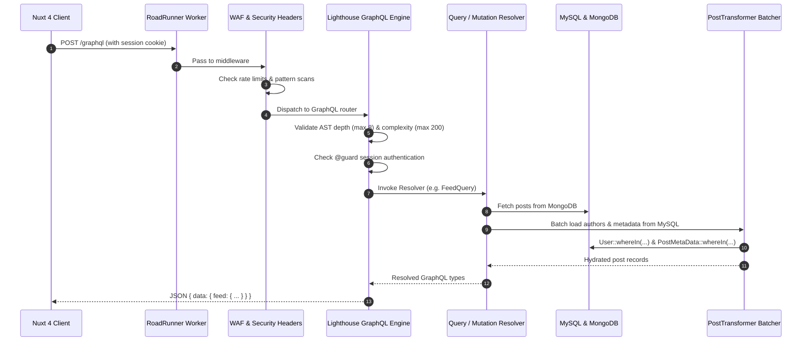

# Architecture

> ThreadsApp API — Laravel 12 + Nuwave Lighthouse (GraphQL) + Hybrid MySQL/MongoDB + RoadRunner

## 1. Overview

ThreadsApp is a high-performance, full-stack social media application modeled after Meta's Instagram Threads. The backend is built to balance massive write workloads with strong relational guarantees:

- **Write-heavy feeds**: Stored in **MongoDB** for schema flexibility, horizontal scalability, and deep hierarchical comment graph lookups (`$graphLookup`).
- **Relational integrity**: Stored in **MySQL** for transactional safety, identity management, and atomic counter caches (`post_meta_data`, `post_likes`, `post_reposts`).
- **GraphQL Protocol**: Single, unified `POST /graphql` endpoint powered by **Nuwave Lighthouse**, eliminating over-fetching and under-fetching.
- **Low latency**: **RoadRunner** persistent worker processes via Laravel Octane, avoiding framework bootstrap overhead on each request.
- **Security-first**: Integrated Web Application Firewall (WAF) and strict GraphQL query depth/complexity limiters.





---

## 2. Technology Stack

| Layer | Choice | Reason |
| :--- | :--- | :--- |
| **Framework** | Laravel 12 (PHP 8.3) | Mature ecosystem, Sanctum authentication, robust dependency injection. |
| **Application Server** | RoadRunner (`spiral/roadrunner-http`) + Octane | High-concurrency persistent workers (~3x throughput vs standard PHP-FPM). |
| **GraphQL Engine** | Nuwave Lighthouse (`^6.70`) | Directive-driven schema (`@guard`), AST caching, depth/complexity security limits. |
| **Developer Tooling** | Laravel GraphiQL (`mll-lab/laravel-graphiql`) | Interactive schema explorer and documentation viewer at `/graphiql`. |
| **Relational DB** | MySQL 8 | Foreign keys, transactional integrity, and atomic counter updates. |
| **Document DB** | MongoDB 6 via `mongodb/laravel-mongodb` | Scalable post feed storage and recursive comment graph traversal. |
| **Security** | Custom WAF + SecurityHeaders | Rate limiting, SQLi/XSS pattern defense, HSTS, CSP headers. |

---

## 3. Project Structure

```
app/
  Actions/              # Atomic write operations (LikePostAction, RepostPostAction, CreateCommentAction)
  Console/Commands/     # WafManageCommand, CreateSearchIndexes
  DTOs/                 # Typed parameter containers (CommentData, InteractionResult)
  GraphQL/
    Mutations/          # GraphQL mutation resolvers (PostMutation, InteractionMutation, CommentMutation, ProfileMutation)
    Queries/            # GraphQL query resolvers (FeedQuery, PostQuery, UserQuery, CommentThreadQuery, etc.)
  Http/
    Controllers/Auth/   # Session auth endpoints (Login, Register, Logout, Password Reset)
    Middleware/         # WebApplicationFirewall, SecurityHeaders
  Models/               # User (MySQL), Post/Comment (MongoDB), PostMetaData/Like/Repost (MySQL)
  Policies/             # PostPolicy, CommentPolicy
  Services/             # PostService, CommentService, UserService, SearchService
  Transformers/         # PostTransformer, CommentTransformer (batch hydration & cache)
config/
  lighthouse.php        # GraphQL guards, schema cache, and depth/complexity security limits
  waf.php               # WAF patterns, IP blacklists, and endpoint rate limits
graphql/
  schema.graphql        # Authoritative GraphQL schema definition
routes/
  auth.php              # Session authentication routes (/auth/*)
  web.php               # Web routing bootstrap
docs/
  API_CONTRACT.md       # GraphQL operations and authentication specification
  ARCHITECTURE.md       # System architecture and data flow (this file)
  GRAPHQL.md            # GraphQL developer guide and learning handbook
  SSD.md                # System sequence diagrams
  WAF_*.md              # WAF implementation and configuration
```

---

## 4. Request Lifecycle



---

## 5. The Hybrid Storage & Batch Loading Pattern

Because `Post` lives in MongoDB and `User` lives in MySQL, cross-database joins are impossible at the database engine level.

### The Batch Loader Solution:
Instead of running a separate query for each post's author ($N+1$ queries):
1. **Extraction**: Collect all unique `user_id`s from the MongoDB post collection.
2. **Bulk Fetch**: Execute a single `User::whereIn('id', $userIds)` query against MySQL.
3. **Caching**: Store the fetched authors in memory with a 5-minute TTL via `Cache::remember`.
4. **Metadata Bulk Fetch**: Execute a single `PostMetaData::whereIn('post_id', $postIds)` query.
5. **Assembly**: PostTransformer maps the MySQL authors and metadata onto the MongoDB post objects before serializing them into the GraphQL response.
