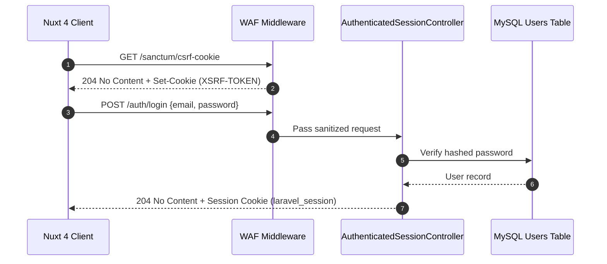
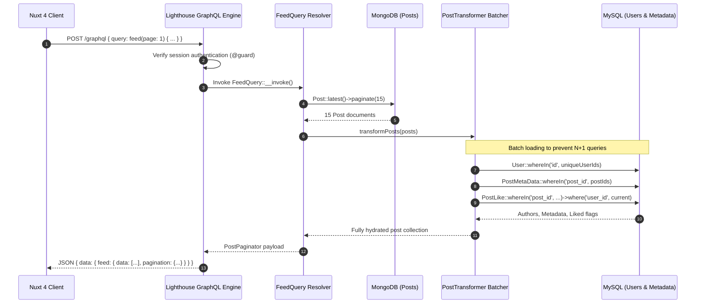
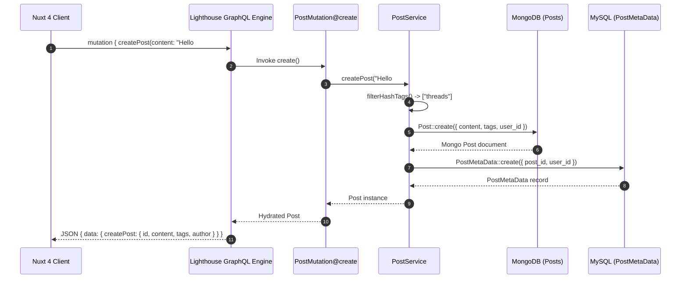
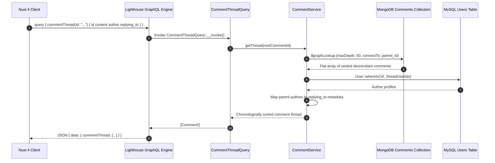

# Software Design Document (SSD)

> ThreadsApp API — Version 2.0 (GraphQL Architecture)

## 1. Purpose & Scope

This document captures requirements, architectural decisions, component interactions, and sequence workflows for the ThreadsApp API. It serves as the authoritative technical reference for developers maintaining and extending the platform.

### 1.1 Definitions
* **SSD** — Software Design Document.
* **WAF** — Web Application Firewall middleware.
* **Hybrid DB** — MySQL for relational integrity and counters, MongoDB for content documents.
* **Lighthouse** — Nuwave Lighthouse GraphQL server for Laravel.

---

## 2. Requirements Matrix

### 2.1 Functional Requirements

| ID | Requirement | Priority | Implementation |
| :--- | :--- | :--- | :--- |
| **F-01** | User registration, login, logout, password reset | Must | Laravel Breeze HTTP routes (`/auth/*`) |
| **F-02** | Create, read, update, delete own posts | Must | GraphQL `createPost`, `updatePost`, `deletePost` mutations |
| **F-03** | Paginated global feed and user post feeds | Must | GraphQL `feed`, `myPosts`, `userPosts` queries with batch loading |
| **F-04** | Like, unlike, and repost posts with counters | Must | GraphQL `likePost`, `unlikePost`, `repost` mutations |
| **F-05** | Liked posts feed | Must | GraphQL `myLikedPosts` query |
| **F-06** | Root comments and deep nested comment threads | Must | GraphQL `postComments`, `commentThread` (via `$graphLookup`), `createComment` |
| **F-07** | Search users and posts with hashtag matching | Should | GraphQL `search` query with MongoDB regex matching |
| **F-08** | WAF protection and GraphQL depth/complexity limits | Must | WAF middleware + Lighthouse security configurations |

### 2.2 Non-Functional Requirements

| ID | Requirement | Target Metric |
| :--- | :--- | :--- |
| **NF-01** | **Throughput** | 10k+ requests/sec using RoadRunner persistent PHP workers via Laravel Octane. |
| **NF-02** | **Latency** | p95 < 100ms for feeds via bulk MySQL author batch hydration and 5-minute caching. |
| **NF-03** | **Security** | OWASP Top-10 protection via WAF, max query depth of 8, and max complexity of 200. |
| **NF-04** | **Consistency** | Zero cross-database N+1 queries using centralized DataLoader resolvers. |

---

## 3. System Sequence Diagrams (SSD)

### 3.1 Authentication & Session Bootstrap

### 3.2 Feed Query with Hybrid Batch Loading

### 3.3 Post Creation with Hashtags

### 3.4 Recursive Comment Thread Retrieval

