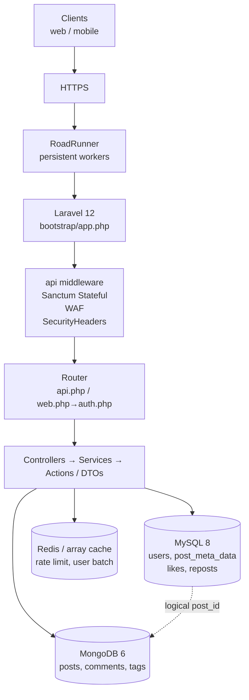
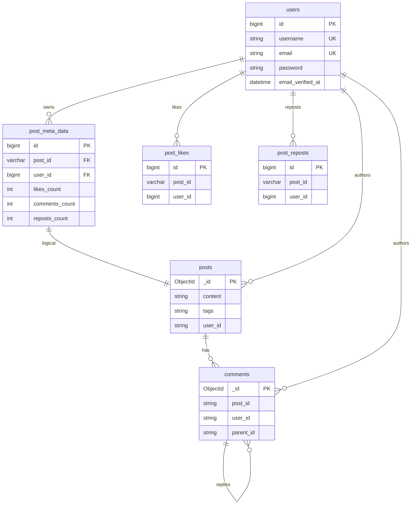
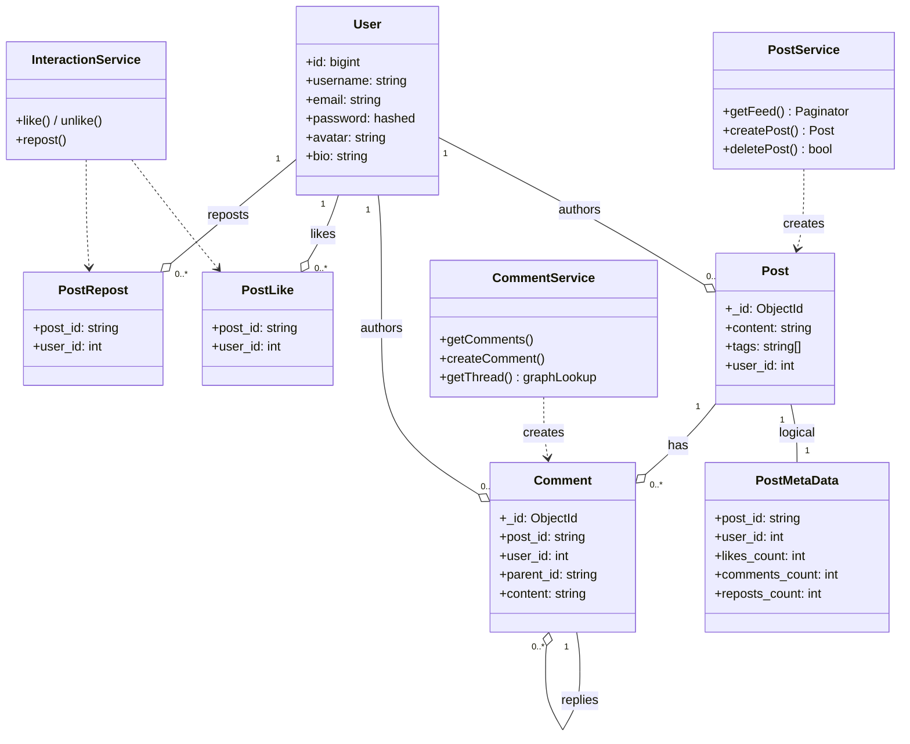
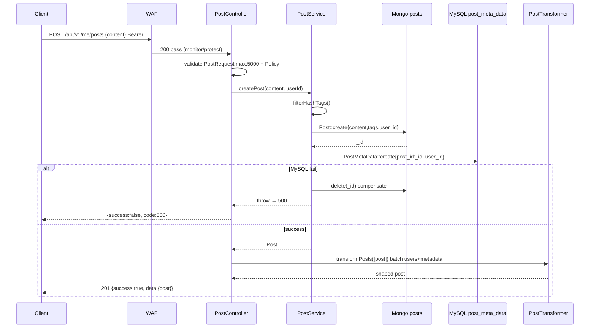
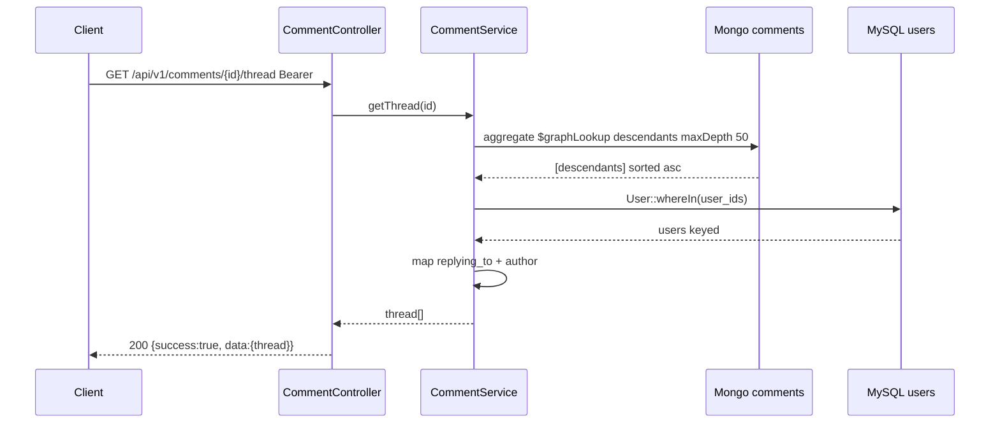
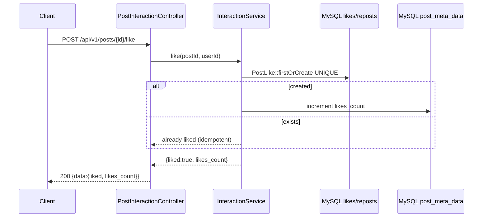
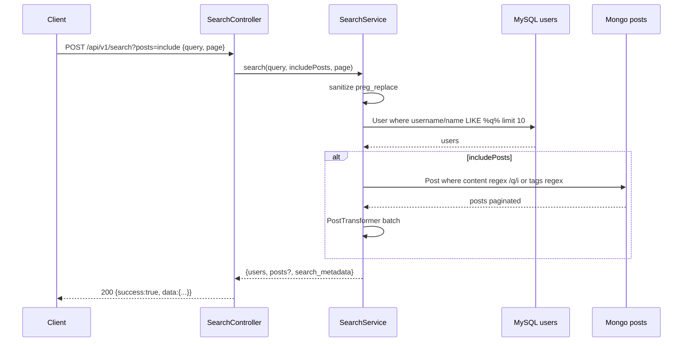
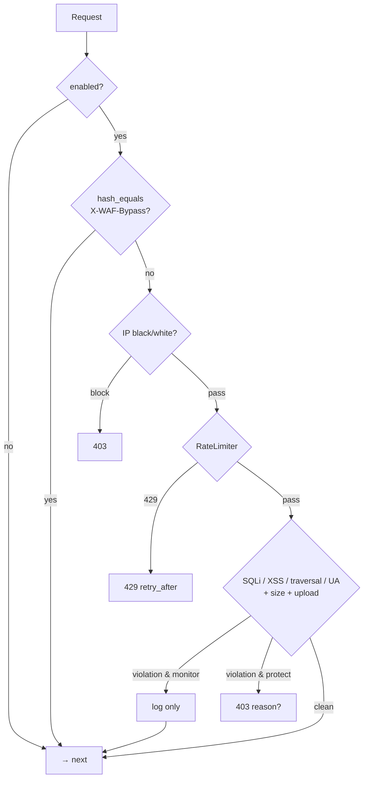

# Software Design Document (SSD)

> ThreadsApp API — Version 1.0 — 2026-08-25

## 1. Purpose & Scope

This document captures requirements, architecture, data design, component design, and operational concerns for the ThreadsApp API. It complements `ARCHITECTURE.md` (how it’s built) and `API_CONTRACT.md` (how to call it) with the *why* and *what*.

### 1.1 Stakeholders

* End users (mobile/web clients via `/api/v1/*`)
* Platform team (operate MySQL/Mongo/Redis/RoadRunner)
* Security (WAF ownership)

### 1.2 Definitions

* **SSD** — Software Design Document.
* **WAF** — Web Application Firewall (middleware).
* **Hybrid DB** — MySQL for relational data, MongoDB for documents.

## 2. Requirements

### 2.1 Functional

| ID | Requirement | Priority | Status |
|----|-------------|----------|--------|
| F-01 | Register / login / logout / password reset / email verification | Must | Done (Breeze `routes/auth.php`) |
| F-02 | Create / read / update / delete own posts with hashtag extraction | Must | Done (`PostService`+`PostPolicy`) |
| F-03 | Public feed + per-user post/repost listings, paginated | Must | Done (`PostService::getFeed`, `UserService`) |
| F-04 | Like / unlike, repost, share, interaction counters | Must | Done (`InteractionService`+Actions) |
| F-05 | Comment on post, reply to comment, fetch replies/thread, delete own comment | Must | Done (`CommentService` → `CreateCommentAction`, `$graphLookup`) |
| F-06 | Search users; optional post search with `?posts=include` | Should | Done (`SearchService`) |
| F-07 | Utility probes `waf-test`, `ping-mongodb` (unauthenticated, sanitized) | Should | Done (`UtilityController`) |
| F-08 | Security headers + WAF on all API routes | Must | Done (`SecurityHeaders`, `WebApplicationFirewall`) |

### 2.2 Non-Functional

| ID | Requirement | Target |
|----|-------------|--------|
| NF-01 | Availability | 99.9% (RoadRunner workers + stateless API) |
| NF-02 | Latency p95 | <150 ms for feed/search (cached user batches, indexed Mongo) |
| NF-03 | Scale | 10k rps feed reads; Mongo horizontal shard-ready |
| NF-04 | Security | OWASP Top-10 mitigations via WAF + headers + validation + hash_equals bypass |
| NF-05 | Operability | `php artisan waf …` + `CreateSearchIndexes` + health `/up` + `/api/ping-mongodb` + daily logs |
| NF-06 | Testability | `RefreshDatabase`, `Sanctum::actingAs`, PHPUnit 11; `WafTest` as contract |

### 2.3 Out of Scope (v1)

Real-time (WebSockets), media uploads beyond `file_upload` validation, moderation queue, notifications, OAuth providers.

## 3. System Overview



## 4. Architecture Decisions (ADRs)

| ADR | Decision | Rationale | Consequence |
|-----|----------|-----------|-------------|
| 1 | Hybrid MySQL+Mongo | Feed benefits from document flexibility + scale; counters need relational integrity | Cross-DB compensation instead of XA |
| 2 | RoadRunner over php-fpm | Persistent bootstrap, lower latency; no Swoole extension | Binary `rr` shipped, config in `.rr.yaml` |
| 3 | Regex WAF in middleware | No extra proxy, simple `config/waf.php`, `monitor` vs `protect` | Regex brittle; mitigated by tests + allowlist |
| 4 | Services+Actions+Transformers | Thin controllers, testable orchestration, N+1 batch loading | More indirection, but matches existing refactor |
| 5 | `hash_equals` for bypass | Timing-safe compare for `X-WAF-Bypass` | Requires `is_string` guard |
| 6 | `$graphLookup` for threads | Single aggregation for nested replies vs N+1 frontier loop | Ties to Mongo; fallback to iterative loop if needed |

## 5. Data Design

### 5.1 ERD (logical) — see `database/SCHEMA.md` for full DDL



> Full columns, indexes and MySQL ↔ Mongo logical links: `database/SCHEMA.md` (`docs/database/SCHEMA.md` mirror).

### 5.2 MySQL Schema (key tables)

```sql
users(id PK, name, username UNIQUE, email UNIQUE, avatar, bio, email_verified_at, password hashed, timestamps)
post_meta_data(id PK, post_id VARCHAR(255), user_id FK, likes_count INT DEFAULT 0, comments_count INT DEFAULT 0, shares_count INT DEFAULT 0, reposts_count INT DEFAULT 0)
post_likes(id PK, post_id VARCHAR, user_id FK, timestamps, UNIQUE(post_id,user_id))
post_reposts(id PK, post_id VARCHAR, user_id FK, timestamps, UNIQUE(post_id,user_id))
```

### 5.3 Mongo Schema

```js
posts: { _id:ObjectId, content:String, tags:String[], user_id:Number, created_at:ISODate, updated_at:ISODate }
comments: { _id:ObjectId, content:String, post_id:String, user_id:Number, parent_id:String|null, created_at:ISODate }
```

Indexes: `posts.user_id`, `posts.tags`, `posts.created_at` (via `CreateSearchIndexes`); `comments.post_id`, `comments.parent_id`.

### 5.4 Counters

Denormalized in `post_meta_data` for fast feed hydration. Maintained by Actions; `CommentService::deleteComment` does `where(comments_count,>,0)->decrement`; failures are logged `warning` (tolerable drift).

## 6. Component Design

### 6.1 Controllers

* `PostController` (7 actions) — `PostRequest` validation, `PostPolicy`, `PostService`, `PostTransformer`.
* `CommentController` — delegates entirely to `CommentService` (thin, see `ARCHITECTURE.md:6`).
* `PostInteractionController` — like/share/repost + `check*` + `interactions`.
* `ProfileController` → `UserService`.
* `SearchController` → `SearchService`.
* `UtilityController` — `wafTest` (diagnostics only) + `pingMongoDb` (`config()` + `DB::connection('mongodb')`, generic 500).
* `Auth/*` — Breeze session flow.

### 6.2 Services

* `PostService::createPost` — hashtag filter → `Post::create` → `PostMetaData::create` or rollback; `deletePost` compensates metadata.
* `CommentService::getThread` — `$graphLookup` from root comment → flatten/sort asc → attach `replying_to`.
* `SearchService` — sanitize query, `User LIKE`, optional `Post content/tags regex`.
* `UserService` — `getAuthUser`, `getUserWithPosts`, `getReposts` via `PostService::getRepostedPosts`.

### 6.3 Middleware

* `WebApplicationFirewall` — ordered: enabled? → bypass? → IP → rate limit → patterns → sizes → uploads. `hash_equals` for bypass; `RateLimiter` with `waf:*` keys.
* `SecurityHeaders` — `BinaryFileResponse` bypass, HSTS, CSP prod-only, `Cache-Control` for `api/*`.
* `EnsureEmailIsVerified` — alias `verified`.

### 6.4 Transformers

`PostTransformer::transformPosts` handles `Collection` vs `LengthAwarePaginator`, caches user batches (`md5(userIds)` 300s), fetches metadata/likes/reposts in 3 queries, maps to feed shape.



## 7. Sequence Diagrams

### 7.1 Create Post



### 7.2 Comment Thread



### 7.3 Like / Repost Toggle



### 7.4 Search



### 7.5 WAF Decision



## 8. Security Design

* **WAF** — patterns (`config/waf.php`): SQLi (union/select/insert/drop/OR 1=1/--/benchmark…), XSS (`<script`/`javascript:`/on*/`alert`/`document.`), traversal (`../`/`/etc/passwd`/`.env`), UA block (`sqlmap`/`nikto`/…); file block list (`php`/`exe`/…); limits (`max_post_size` 10 MB, `max_uri_length` 2 KB). Mode `monitor`/`protect`, `bypass_tokens` via `X-WAF-Bypass`, IP lists.
* **Headers** — as in §6.3.
* **Auth** — Sanctum stateful (`EnsureFrontendRequestsAreStateful` before WAF), `HasApiTokens`, `password:hashed`, `remember_token` hidden, `signed` verify, `throttle:6,1`.
* **Sanitization** — `UtilityController` no reflection, `SearchService` strips non-alnum, WAF scans `headers+body+uri`.
* **Logging** — `waf` channel (`daily`, `warning`, 30 days), `Log::channel($channel)->$level` with `{type,ip,method,uri,ua,details}`.

## 9. Performance & Scalability

* RoadRunner reuse, OpCache, `Cache::remember` for users, Mongo `latest()` with indexes, pagination caps, `RateLimiter` in Redis/array.
* Horizontal: stateless API (except session for `/auth`), Mongo shard by `user_id` or `_id`, MySQL read replica for feed metadata.

## 10. Operational

* Env: `WAF_*`, `MONGODB_URI/DATABASE`, `REDIS_*`, `APP_ENV` (see `README: Quick Start`).
* Commands: `php artisan waf status|logs|clear-rate-limits|clear-logs`, `php artisan search:indexes` (CreateSearchIndexes).
* Health: `GET /up`, `GET /api/ping-mongodb`.
* Logs: `storage/logs/waf.log` (also `laravel.log` via `daily` channel).
* CI: `php artisan test --filter=WafTest|MongoDBTest|…`, `vendor/bin/pint --dirty`.

## 11. Risks & Mitigations

| Risk | Impact | Mitigation |
|------|--------|------------|
| Counter drift (cross-DB) | Stale likes/comments | Periodic reconciliation job (future) |
| Regex false positives | Block legitimate posts | `monitor` mode + whitelist + pattern tuning |
| Mongo availability | Feed outage | `ping-mongodb` + retry + circuit breaker (future) |
| N+1 on transformers | Latency | Batch `whereIn` + cache; monitor `Cache` hit rate |

## 12. Future Work

* Media uploads (S3), notifications, WebSocket feed, moderation, OAuth, OpenAPI spec generation from `API_CONTRACT.md`.

## 13. References

* `ARCHITECTURE.md`, `API_CONTRACT.md`, `docs/WAF_README.md`, `docs/WAF_IMPLEMENTATION.md`.
* OWASP WAF / Top 10, Laravel 12 docs, MongoDB `$graphLookup`.

